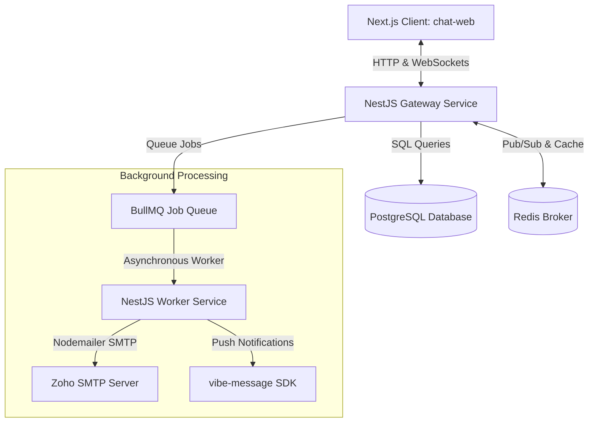

# RelayFlow (Real-Time Communication Platform)

RelayFlow is a modern, high-performance real-time messaging platform built using a NestJS and Next.js monorepo architecture. The platform demonstrates production-grade system design, asynchronous event processing, presence tracking, and scalable backend services.

---

## Architecture Overview

RelayFlow is designed as an **Nx Monorepo** structured around three primary applications and modular shared libraries.



---

## Application Structure

All apps reside in the `apps/` folder:

### 1. `apps/chat-web` (Next.js Frontend Client)

- **Stack**: Next.js, React, TailwindCSS, Redux Toolkit, Socket.IO Client.
- **Purpose**: Responsive chat interface for end users.
- **Core Flows**:
  - Real-time text messaging, typing indicators, read receipts, and friends list dashboards.
  - Registering Service Workers with the `vibe-message` push notification client in the user's browser for foreground/background alerts.

### 2. `apps/gateway` (NestJS Monolith API & WebSocket Server)

- **Stack**: NestJS, TypeORM, Socket.IO.
- **Purpose**: Entrypoint API and WebSockets server.
- **Modules**:
  - `AuthModule`: Handles register/login, verification codes, JWTs, and 2FA.
  - `UsersModule`: Profiles, friend relations, search functionality.
  - `ChatModule` / `GroupsModule`: Handles messages, conversations, and channel groups.
  - `RealtimeModule`: Persistent WebSocket connection gateway (`RealtimeGateway`) representing presence tracking, typing states, and message forwarding.
  - `EmailModule`: Interfaces with BullMQ to push transactional email tasks to the queue.

### 3. `apps/worker-service` (NestJS Asynchronous Background Processor)

- **Stack**: NestJS, BullMQ, Nodemailer, EJS Templates, vibe-message.
- **Purpose**: Background execution handler for offloading non-blocking workflows.
- **Processors**:
  - `NotificationProcessor`: Deliver web push notifications using the server-side `vibe-message` SDK.
  - `EmailProcessor`: Render EJS templates (`verification`, `two-factor`, `forgot-password`) and dispatch SMTP transactional emails.

---

## Database & Broker Ownership

### PostgreSQL

Stores structural system data and persistence models:

- **Users & Sessions**: Identifiers, security details (hashes, active OTP states), and notification preferences.
- **Conversations & Members**: Relationships linking users to direct messages (DMs) or group channels.
- **Messages**: Chat logs, media metadata, and delivery states.

### Redis

Used as a real-time data broker and cache:

- **Presence tracking**: Current status (`online`, `offline`, `away`, `dnd`) and `lastSeen` metadata.
- **Typing state caching**: Micro-state triggers.
- **Socket mapping**: Mappings of connected user socket IDs to distribute incoming real-time messages.
- **BullMQ storage**: Stores job data and state transitions for the queue management system.

---

## Workflow & Communication Flows

### 1. Asynchronous User Registration / Verification Workflow

1. User registers via `POST /auth/register` on the **Gateway**.
2. **Gateway** saves the unverified user with a 6-digit OTP code to **PostgreSQL**.
3. **Gateway** dispatches a `send-verification-email` job to the `emails` BullMQ queue.
4. **Gateway** instantly returns a `201 Created` HTTP response to the client (yielding an extremely fast user experience).
5. In the background, **Worker Service** picks up the job from the queue, renders the `verification.ejs` template, and sends the email via SMTP.

### 2. Real-Time Chat Delivery Workflow

1. User sends a message over Socket.IO (`send.message`) to **Gateway**.
2. **Gateway** records the message to **PostgreSQL**.
3. **Gateway** emits `message.new` to all active socket connections in the conversation room.
4. For users who are offline or away, the **Gateway** adds a `send-push` job to the `notifications` BullMQ queue.
5. In the background, **Worker Service** processes the job and calls the `vibe-message` API to push an alert to the user's client devices.

---

## Quick Reference Scripts

Run these from the root directory:

- **Serving Apps (Development)**:
  ```bash
  npm run serve-all
  ```
- **Serving Apps (Production)**:
  ```bash
  npm run serve-all:prod
  ```
- **Building All Apps**:
  ```bash
  npm run build-all
  ```
- **Linting All Projects**:
  ```bash
  npm run lint:all
  ```
